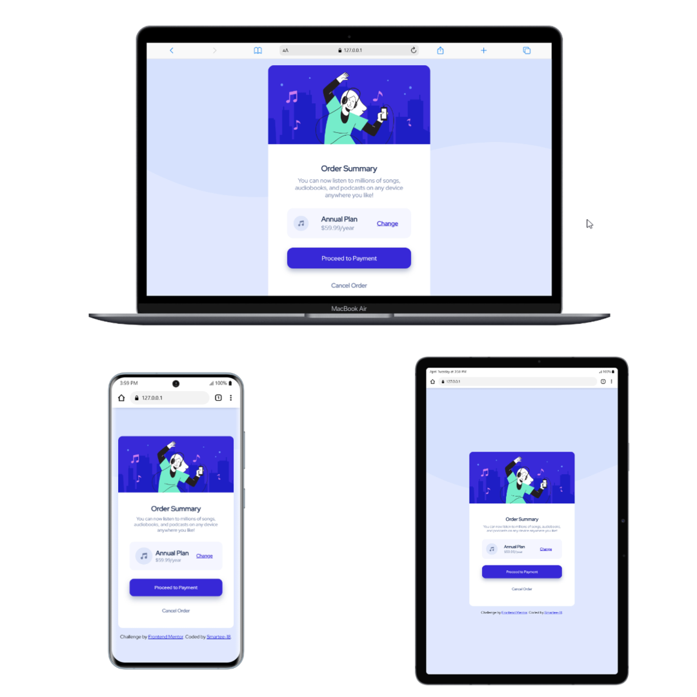

# Frontend Mentor - Order Summary Card Solution

This is my solution to the [Order Summary Card challenge](https://www.frontendmentor.io/challenges/order-summary-component-QlPmajDUj) on Frontend Mentor. Frontend Mentor challenges help you improve your coding skills by building realistic projects. 
## Table of contents

- [Overview](#overview)
  - [The challenge](#the-challenge)
  - [Screenshot](#screenshot)
  - [Links](#links)
- [My process](#my-process)
  - [Built with](#built-with)
  - [What I learned](#what-i-learned)
  - [Continued development](#continued-development)
  - [Useful resources](#useful-resources)
- [Author](#author)
- [Acknowledgments](#acknowledgments)


## 📌 Overview
  The goal of this project was to build a responsive card component and implement clean UI interactions such as hover states.

### ✅ The Challenge

Users should be able to:

- View the optimal layout depending on their device screen size
- See hover states for interactive elements


### 📸 Screenshot




### 🔗 Links

- **Solution URL:** [ https://your-solution-url.com ] (https://www.frontendmentor.io/solutions/responsive-order-summary-card-AZfyeWuibm)
- **Live Site URL:** [ https://your-live-site-url.com] (https://smartee-17.github.io/Order-Summary-Card-Challenge/order-summary-component-main%20-%20Copy/)


## ⚙️ My Process

### 🛠️ Built With

- Semantic HTML5
- CSS Custom Properties (Design System)
- Flexbox & CSS Grid
- Mobile-first workflow

---

### 🧠 What I Learned

This project helped me strengthen my understanding of:

- Structuring layouts using **Flexbox and Grid together**
- Creating a reusable **design system with CSS variables**
- Managing responsive typography using `calc()` and viewport units
- Organizing CSS using `@layer` for better scalability

Example:

```css
.plan-container {
  display: grid;
  grid-template-columns: 25% 50% 25%;
} 
```
---

### 🚀 Continued Development

Going forward, I want to:

- Improve accessibility (ARIA roles, better semantics)
- Refine responsive design patterns
- Explore component-based architecture (React/Next.js)

### 📚 Useful Resources
- https://developer.mozilla.org/en-US/docs/Web/CSS
- https://css-tricks.com/

## 👤 Author
- Frontend Mentor - https://www.frontendmentor.io/profile/smartee-17
- GitHub - https://github.com/smartee-17

## 🙌 Acknowledgments

Thanks to Frontend Mentor for providing structured challenges that simulate real-world UI development.
